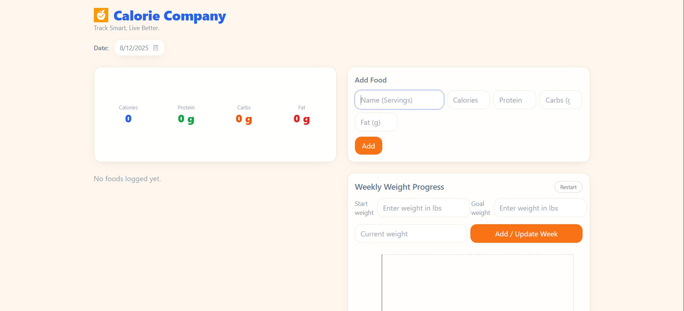
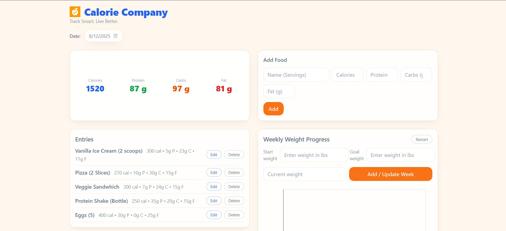
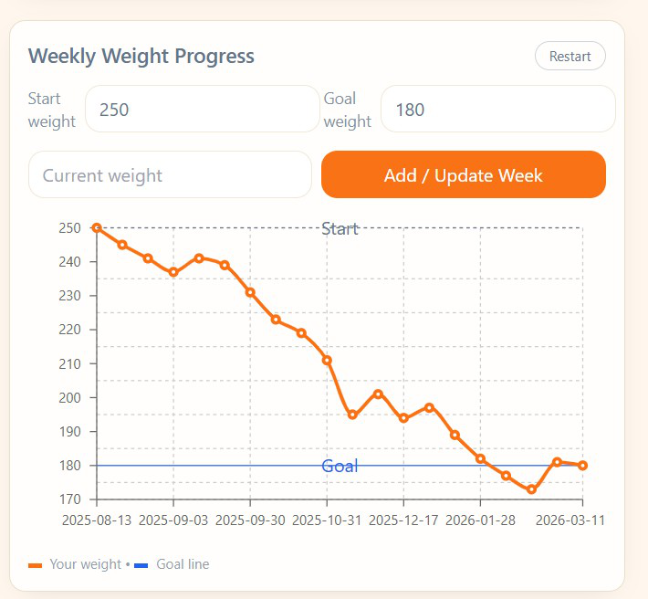

# CalorieCompany

CalorieCompany is a full-stack web application for tracking daily calorie intake, monitoring progress toward weight goals, and visualizing health data. The app is designed for athletes, college students, and health-conscious users who want an easy way to log meals, review nutrition trends, and track weight changes over time.


This repository contains two main components:
- **Client**: Vite + React + TypeScript + Tailwind (located in `client/`)
- **Server**: Node.js + Express + Mongoose (located in `server/`)

## Quick start

1. Install dependencies for both apps

```bash
cd client && npm install
cd ../server && npm install
```

2. Start each app in separate terminals

Terminal 1 (client):

```bash
cd client
npm run dev
```

Terminal 2 (server):

```bash
cd server
npm run dev
```

The client defaults to `http://localhost:5173` and expects the API at `http://localhost:4000/api`.

## Environment

- Client: set `VITE_API_URL` in `client/.env` to point to a different API if needed
- Server: set `MONGODB_URI` in `server/.env`

## Features
- User-Friendly Dashboard – Displays total calories and nutritional breakdown.

- Add Entry Form – Quickly log meals with calorie counts.

- Weight Progress Chart – View weight changes over time with interactive charts.

- Responsive Design – Works on desktop and mobile devices.

- Data Persistence – All data stored securely in MongoDB via the backend API.

## Future Development Roadmap
- Add user authentication for personalized data.

- Implement nutrition macros tracking (protein, carbs, fat).

- Introduce goal-setting and progress notifications.

- Add mobile app version using React Native.

## Known Issues / Limitations
- No login system; all data is currently shared

- Basic analytics; advanced reports planned

- Weight tracking requires manual input

## API Documentation

The backend provides a RESTful API for managing calorie entries and weight data. All endpoints are prefixed with `/api`.

### Base URL

```
http://localhost:4000/api
```

### Endpoints

#### Health Check

- **GET** `/api/health`
- **Description**: Simple health check endpoint for troubleshooting
- **Response**: `{ "ok": true }`

#### Entries Management

##### Get Entries

- **GET** `/api/entries`
- **Query Parameters**:
  - `date` (optional): Filter entries by date (format: `yyyy-mm-dd`)
- **Description**: Retrieve calorie entries. If no date is provided, returns the latest 50 entries.
- **Response**: Array of entry objects
- **Example**: `GET /api/entries?date=2024-01-15`

##### Create Entry

- **POST** `/api/entries`
- **Description**: Create a new calorie entry
- **Request Body**:

```json
{
  "date": "2024-01-15",
  "name": "Chicken Breast",
  "calories": 165,
  "protein": 31,
  "carbs": 0,
  "fat": 3.6
}
```

- **Response**: Created entry object with `_id` and timestamps

##### Update Entry

- **PUT** `/api/entries/:id`
- **Description**: Update an existing entry by ID
- **Request Body**: Same format as POST (all fields optional)
- **Response**: Updated entry object
  
##### Delete Entry

- **DELETE** `/api/entries/:id`
- **Description**: Delete an entry by ID
- **Response**: `{ "ok": true }`

### Data Models

#### Entry Schema

```typescript
interface Entry {
  _id: string; // MongoDB ObjectId
  date: string; // Date in yyyy-mm-dd format
  name: string; // Food/meal name
  calories: number; // Calorie count (min: 0)
  protein: number; // Protein in grams (min: 0, default: 0)
  carbs: number; // Carbohydrates in grams (min: 0, default: 0)
  fat: number; // Fat in grams (min: 0, default: 0)
  createdAt: Date; // Entry creation timestamp
  updatedAt: Date; // Last update timestamp
}
```

### Validation

Request data is validated using Zod schemas:

- Date must be at least 10 characters (yyyy-mm-dd format)
- Name must be non-empty
- Calories must be non-negative
- Protein, carbs, and fat must be non-negative (default to 0 if not provided)

## Git commits

## Pushing This Project to GitHub

Since this repository already exists remotely and contains files like `.gitignore` and `package.json`, here are the commands used to push the local project to GitHub:

```bash
# Navigate to the project root (contains package.json and .gitignore)
cd path/to/your/project

# Initialize Git if not already done
git init

# Link local repo to the existing GitHub repo
git remote add origin https://github.com/USERNAME/REPO-NAME.git

# Stage all changes
git add .

# Commit the changes
git commit -m "Adding full project files"

# Push to the remote repository
git push -u origin main
```
## Demo Video


## Screenshots

### Home Page


### Add Entry Form


### Weight Progress Chart


## Contact 
- Developer: Vraj Patel
- Email: vrajp@vt.edu

- Github: https://github.com/camelCase5
